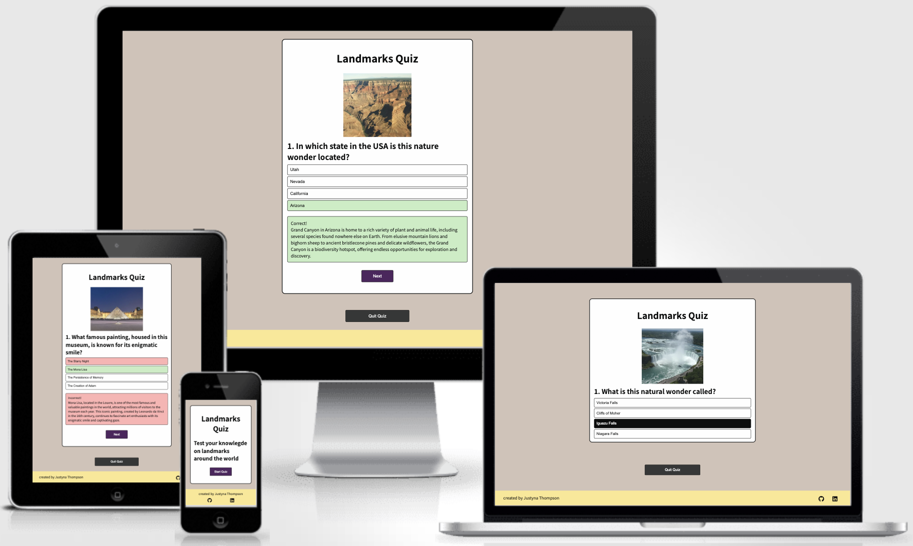
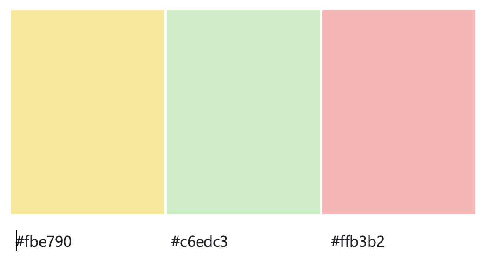
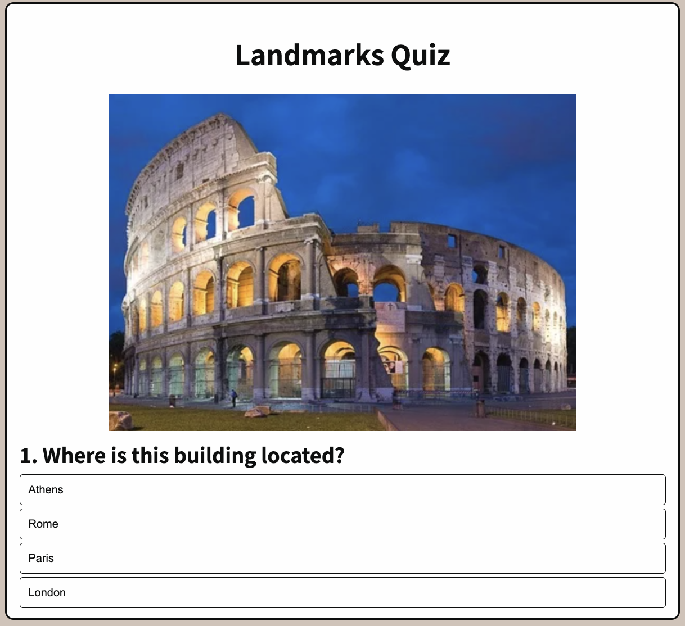
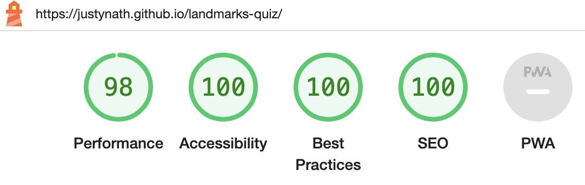
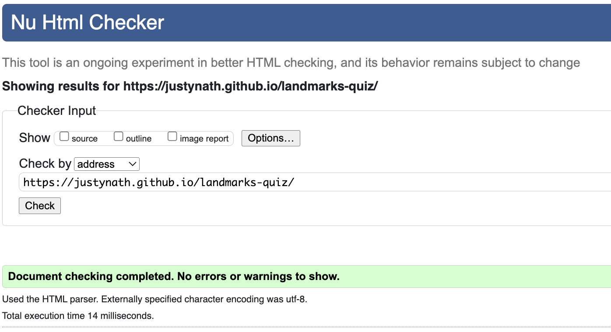
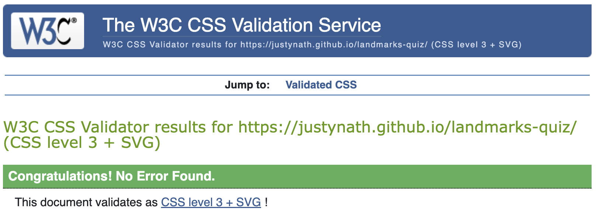

# Landmarks Quiz

## Overview
---
Landmarks is a quiz featuring questions about the locations, history, and interesting facts about landmarks around the world. It is designed for anyone who has an interest in landmarks or would like to develop one, allowing them to test their current knowledge and learn more about globally recognized significant features, both man-made and natural wonders.

[live site](https://justynath.github.io/landmarks-quiz/)

## Planning

### Aim
The aim of the quiz is both entertainment and educational. It features a variety of questions about the location, history, and features of landmarks. Additionally, after answering each question, users are introduced to an interesting fact that elaborates on the question.

### Targeted Audience
The quiz is designed for anyone interested in famous buildings, statues, and natural wonders that are easily identifiable based on their popularity and distinctive features. It caters to avid travelers as well as those aspiring to travel, along with individuals who enjoy taking quizzes to test their general knowledge.

### User Stories
- As a user, I want to understand the purpose of this website quickly and easily.
- As a user, I want to easily navigate this website.
- As a user, I want to test my knowledge on landmarks.
- As a user, I want to know instantly if my answer is correct.
- As a user, I want to learn more about each question.
- As a user, I want to know my score (how many correct answers I got).
- As a user, I want to have an option to take the quiz again.
- As a user, I want to feel positive about my attempt and encourage to improve my score.

---

## UX

### Strategy
The primary objective of the site is to engage users in an entertaining manner while providing them with the opportunity to test their knowledge of landmarks worldwide. Additionally, the platform encourages users to delve deeper into their understanding by offering opportunities for further exploration and elaboration on their existing knowledge.

### Scope
I want the user to have the opportunity to see the visual representation of the landmark as well as be able to choose and answer from four given options. I want the user to get instant feedback on their answer and access additional information related to the question. I want the user to feel like they are learning by completing the quiz. I want the user to see their final score and feedback on how they are doing including encouragement to try again with **new randomly selected questions**. I want the user to feel positive throughout and after completing the quiz as well as inspired to attempt it again.

### Structure
The quiz is structured into three main stages:

1. **Welcome page:** Users are greeted with the main title of the quiz, 'Landmarks,' and provided with instructions on how to begin. They can initiate the quiz by clicking a designated button that leads them to the first question.
2. **Questions:** The questions are randomly selected: 7 out of 25 questions in the array. Each question is accompanied by a corresponding image, the question itself, and four answer options. Upon selecting an option, users receive instant feedback, and additional information about the landmark is provided. Users can proceed to the next question by clicking the 'Next' button.
3. **Feedback page:** The user's final score is displayed, along with feedback indicating their performance. They are encouraged to retake the quiz with new 7 randomly selected questions by clicking the 'Try again' button.

Each page includes **footer** containing information about the creator of the quiz.

### Skeleton
The website is designed to be clear and simple, with the main purpose of entertainment and education at the same time. Features are arranged hierarchically to follow the order of importance.

[wireframes](./assets/readme-resources/landmarks.pdf)

### Surface

#### Colour Palette

I used this color palette as the base for a clean and aesthetic look.

The base colours have been complemented with these softer, more pastel colours for displaying correct answers and the footer. The aim was for positive user experience by avoiding rich, 'shouting' colours.

#### Images
The images used in this quiz represent the landmarks, aiding recognition through visual cues.

---

## Technologies
1. HTML - To create the three pages: home, current reading and sign up
2. CSS - To create a nice, standout front-end and to give a great user experience
3. JavaScript - To add interactivity for the user, react to user's action and give feedback
4. Balsamiq - To create a wireframe

---

## Features 

### Welcome Page
The whole quiz is contained within a frame to narrow the focus and eliminate distractions from other elements. It includes the title, a welcoming message, and the 'Start Quiz' button.

### Question
- A question is displayed with an image, the question itself, and four answer option buttons. The buttons change background color when hovered over. 
**The questions are randomly selected each time the user takes the quiz (7 questions out of 25).**

- If the answer is correct, the background of the selected button changes to green, and nn additional element with green background and an interesting fact appears.

- If the answer is incorrect, the background of the selected button changes to red, while the background of the button with the correct answer changes to green. An additional element with red background and an interesting fact appears.

### Feedback.
- The score is displayed as the number of correct answers out of the total number of questions answered.
- If the score is equal to or greater than 50%, the background changes to green, and positive feedback is displayed. 

- If the score is less than 50%, the background changes to red, and constructive feedback is displayed. 
- There's a button labeled 'Try Again' that allows users to attempt another set of 7 randomly selected questions.

### The Footer
The footer contains information about the author of the page and the links to the Github repository and the LinkedIn profile.
*Footer*

*Footer on mobile*

## Future Features
While the current version of the project is fully functional, I have some exciting features planned for future updates. Here are a few ideas that I didn't have time to implement in this release:

- Implementing user accounts to keep a record of their scores.
- Dividing questions into different grades, with 1, 2, and 3 marking questions based on their difficulty level. Users can select the type of question they want to answer next.

---

## Testing

### Features Testing

|  Feature |  Action | Effect |
|---|---|---|
|Start Quiz button|Click|Displays the first question|
|Next button|Click|Displays the next question|
|Try Again button|Click|Starts the quiz and displays the first question|
|Github link in the footer|Click|Opens the github repository in new tab|
|Linkedin link in the footer|Click|Opens the Linkedin profile in new tab|

### Browsers 

**Supported Browsers and Devices**
My web application is tested and supported on the following browsers and devices:
- Google Chrome (latest version)
- Safari (latest version)

**Responsiveness Testing**
I conduct manual responsiveness testing on Chrome and Safari to ensure a seamless user experience.

**Test Results**

| Device/Screen Size  | Chrome Performance | Safari Performance |
|----------------------|--------------------|---------------------|
| Desktop (2560x1440) | no issues | no issues |
| Laptop (1366x768)   | no issues | no issues |
| Tablet (iPad)       | no issues | no issues |
| Mobile (iPhone 12pro)   | no issues | no issues |

### Lighthouse

**Introduction**
This report presents the results of Lighthouse testing conducted to assess the performance, accessibility, best practices, SEO, and PWA compliance of Landmarks.

**Test Execution**
Lighthouse tests were executed using the Google Chrome browser's DevTools.

**Test Metrics**

### Bugs Resolved

**Introduction**
This section provides a summary of bugs that have been identified, reported, and subsequently resolved in Landmarks.

**Bug Tracking**
Below is a summary of resolved bugs:

| Bug ID | Bug Description | Status |
|--------|-----------------|--------|
| #001   | After adding welcome page, the 'Start Quiz' button not working correctly | Resolved |
| #002   | The background on feedback page is not changing colour | Resolved |
| #003   | The background colour not reseting for first question | Resolved |

**Bug Details**
Here are the details of the resolved bugs:

**Bug #001**
- **Description**:  After I added the welcome page the 'Start Quiz' button was not working correctly (Jumping to question two, then repeating that question in a loop)
- **Resolution**: I removed the original event listener and added a new one to correctly respond to the 'Start Quiz' button
- **Impact**: Including a welcoming page gives more information about the quiz and allows the user to make decision about taking the quiz

**Bug #002**
- **Description**:  The background of the feedback page was not changing despite assigning a variable and getting element by class name
- **Resolution**: The element by class name is returned as an array, hence I needed to use indexing to return the first element
- **Impact**: When the colour of the background changes based on the score it give instant feedback to the user

**Bug #003**
- **Description**:  After taking the quiz for the second time the background of the first question was not reseting
- **Resolution**: I included if/else method in the startQuiz function to reset the background
- **Impact**: The user is reassured that the quiz has restarted and the previous score has been reset

### Validator Testing 

**HTML**
Code has been validated with the official W3C validator and returned no errors or warnings.

**CSS**
Code has been validated with the official (Jigsaw) validator and returned no errors or warnings.

**JavaScript**
Code has been validated with the official (Jshint) validator and returned no errors or warnings.

*Metrics*

There are 13 functions in this file.

Function with the largest signature take 2 arguments, while the median is 0.

Largest function has 16 statements in it, while the median is 6.

The most complex function has a cyclomatic complexity value of 3 while the median is 2.

---

## Deployment

- The site was deployed to GitHub pages. The steps to deploy were as follow: 
  - In the GitHub repository I navigated to the Settings tab 
  - From the source section drop-down menu, I selected the Main Branch
  - Once the main branch was selected, the page automatically refreshed with a detailed ribbon display to indicate the successful deployment. 

The live link can be found here - [live site](https://justynath.github.io/landmarks-quiz/)

---

## Credits 

### Content
- The fonts were imported from [Google Fonts](https://fonts.google.com/)
- The icons used were taken from [Font Awesome](https://fontawesome.com/)
- The colour scheme was inspired by this [article](https://muffingroup.com/blog/calm-color-palette/)
- I used this video tutiorial to set the structure of my quiz [JavaScript Quiz Tutorial](https://www.youtube.com/watch?v=PBcqGxrr9g8)
- I used chatGTP to reaserch information about the landmarks. The text content was written by me and enhanced by ChatGTP
- I used this article and my mentor's support for creating the shuffle function [article](https://medium.com/@omar.rashid2/fisher-yates-shuffle-a2aa15578d2f)

### Media
- I used images from this website [images](https://www.jetpunk.com/quizzes/landmarks-quiz-1)

### Anknowledgements
- Medale Oluwafemi, my mentor at Code Institute for his guidance and invaluable support with this project
- Tutor support at Code Institute for assisting me with solving problems and fixing bugs and errors