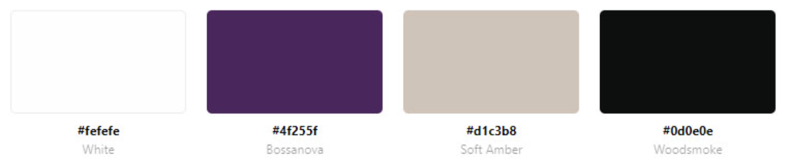

# Landmarks Quiz

## Overview
Landmarks is a quiz featuring questions about the locations, histories, or interesting facts about landmarks around the world. It is designed for anyone who has an interest in landmarks or would like to develop one, allowing them to test their current knowledge and learn more about globally recognized significant features, both man-made and natural wonders.
---

[live site](https://justynath.github.io/landmarks-quiz/)

## Planning

### Aim
The aim of the quiz is both entertainment and educational. It features a variety of questions about the location, history, and features of landmarks. Additionally, after answering each question, users are introduced to an interesting fact that elaborates on the question.

### Targeted Audience
The quiz is designed for anyone interested in famous buildings, statues, and natural wonders that are easily identifiable based on their popularity and distinctive features. It caters to avid travelers as well as those aspiring to travel, along with individuals who enjoy taking quizzes to test their general knowledge.

### User Stories
- As a user, I want to understand the purpose of this website quickly and easily.
- As a user, I want to easily navigate this website.
- As a user, I want to test my knowledge on landmarks.
- As a user, I want to know instantly if my answer is correct.
- As a user, I want to learn more about each question.
- As a user, I want to know my score (how many correct answers I got).
- As a user, I want to have an option to take the quiz again.
- As a user, I want to feel positive about my attempt and encourage to improve my score.

---

## UX

### Strategy
The primary objective of the site is to engage users in an entertaining manner while providing them with the opportunity to test their knowledge of landmarks worldwide. Additionally, the platform encourages users to delve deeper into their understanding by offering opportunities for further exploration and elaboration on their existing knowledge.

### Scope
I want the user to have the opportunity to see the visual representation of the landmark as well as be able to choose and answer from four given options. I want the user to get instant feedback on their answer and access additional information related to the question. I want the user to feel like they are learning by completing the quiz. I want the user to see their final score and feedback on how they are doing including encouragement to try again with randomly selected questions. I want the user to feel positive throughout and after completing the quiz as well as inspired to attempt it again.

### Structure
The quiz is structured into three main stages:

1. **Welcome page:** Users are greeted with the main title of the quiz, 'Landmarks,' and provided with instructions on how to begin. They can initiate the quiz by clicking a designated button that leads them to the first question.
2. **Questions:** Each question is accompanied by a corresponding image, the question itself, and four answer options. Upon selecting an option, users receive instant feedback, and additional information about the landmark is provided. Users can proceed to the next question by clicking the 'Next' button.
3. **Feedback page:** The user's final score is displayed, along with feedback indicating their performance. They are encouraged to retake the quiz by clicking the 'Play again' button.

Each page includes **footer** containing information about the creator of the quiz.

### Skeleton
The website is designed to be clear and simple, with the main purpose of entertainment and education at the same time. Features are arranged hierarchically to follow the order of importance.

[wireframes](assets/readme resources/landmarks.pdf)

### Surface

#### Colour Palette

I uesed this as base colour palette for clean and esthetic look.

The base colours have been complemented with these softer, more pastel colours for displaying correct answers and the footer. The aim was for positive user experience by avoiding rich, 'shouting' colours.

#### Images
The images used for this quiz are to represent the landmark and so it is recognised from the visual representation.

---

## Technologies
1. HTML - To create the three pages: home, current reading and sign up
2. CSS - To create a nice, standout front-end and to give a great user experience
3. JavaScript - To add interactivity for the user, react to user's action and give feedback
4. Balsamiq - To create a wireframe

---

## Features 

### Navbar 

### The Footer

---

## Future Features
While the current version of the project is fully functional, I have some exciting features planned for future updates. Here are a few ideas that I didn't have time to implement in this release:

1. **Sugestion**:
   - details

---

## Testing

### Features Testing

|  Feature |  Action | Effect |
|---|---|---|
|Logo|Click|Brings back to Home page|
||||

### Browsers 

**Supported Browsers and Devices**
My web application is tested and supported on the following browsers and devices:
- Google Chrome (latest version)
- Safari (latest version)

**Responsiveness Testing**
I conduct manual responsiveness testing on Chrome and Safari to ensure a seamless user experience.

**Test Results**

| Device/Screen Size  | Chrome Performance | Safari Performance |
|----------------------|--------------------|---------------------|
| Desktop (2560x1440) | no issues | no issues |
| Laptop (1366x768)   | no issues | no issues |
| Tablet (iPad)       | no issues | no issues |
| Mobile (iPhone 12pro)   | no issues | as Chrome |

**Known Issues**

### Lighthouse

**Introduction**
This report presents the results of Lighthouse testing conducted to assess the performance, accessibility, best practices, SEO, and PWA compliance of Landmarks.

**Test Execution**
Lighthouse tests were executed using the Google Chrome browser's DevTools.

**Test Metrics**

#### index.html

#### current-reading.html

#### signup.html

### Bugs Resolved

**Introduction**
This section provides a summary of bugs that have been identified, reported, and subsequently resolved in Landmarks.

**Bug Tracking**
Below is a summary of resolved bugs:

| Bug ID | Bug Description | Status |
|--------|-----------------|--------|
| #001   | description | Resolved |
| #002   | description | Resolved |
| #003   | description | Resolved |

**Bug Details**
Here are the details of the resolved bugs:

**Bug #001**
- **Description**: 
- **Resolution**: 
- **Impact**: 

### Validator Testing 

**HTML**
Code has been validated with the official W3C validator.

index.html

**CSS**
Code has been validated with the official (Jigsaw) validator

---

## Deployment

- The site was deployed to GitHub pages. The steps to deploy were as follow: 
  - In the GitHub repository I navigated to the Settings tab 
  - From the source section drop-down menu, I selected the Main Branch
  - Once the main branch was selected, the page automatically refreshed with a detailed ribbon display to indicate the successful deployment. 

---

## Credits 

### Content 

### Media

### Anknowledgements

